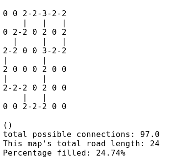
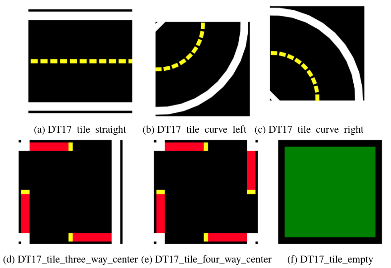
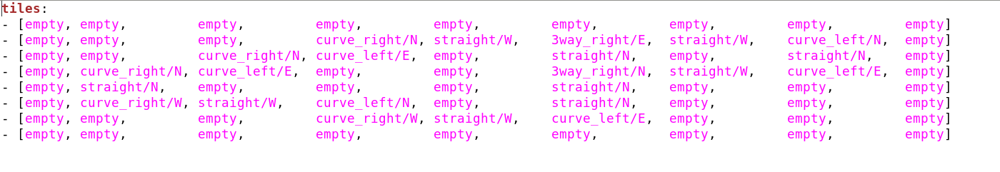
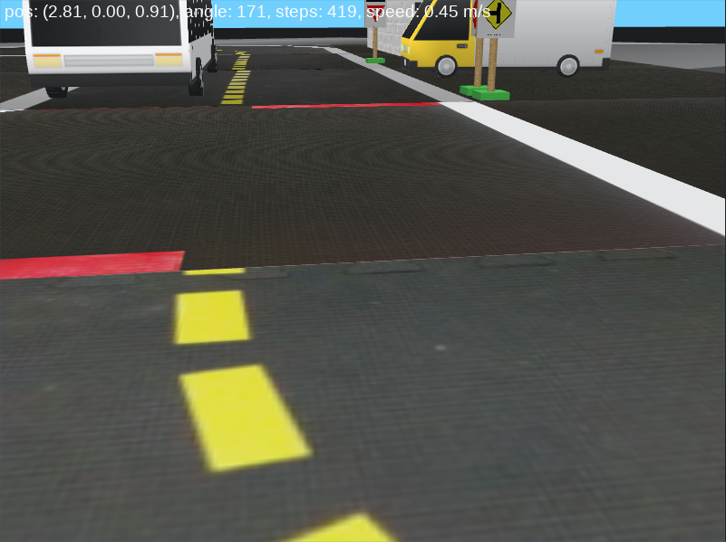
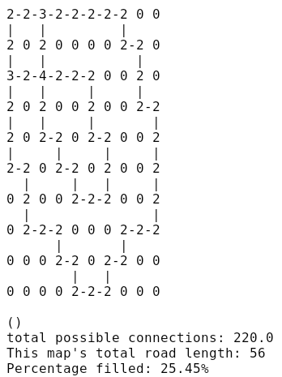
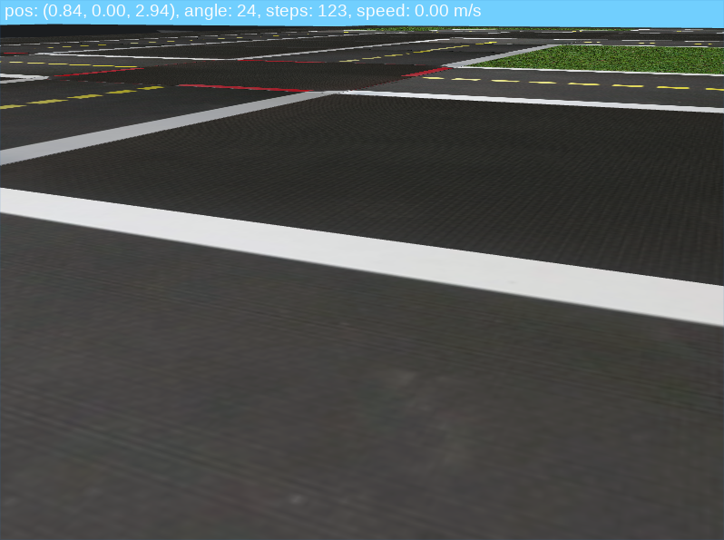
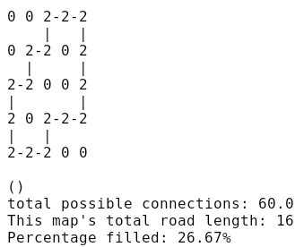
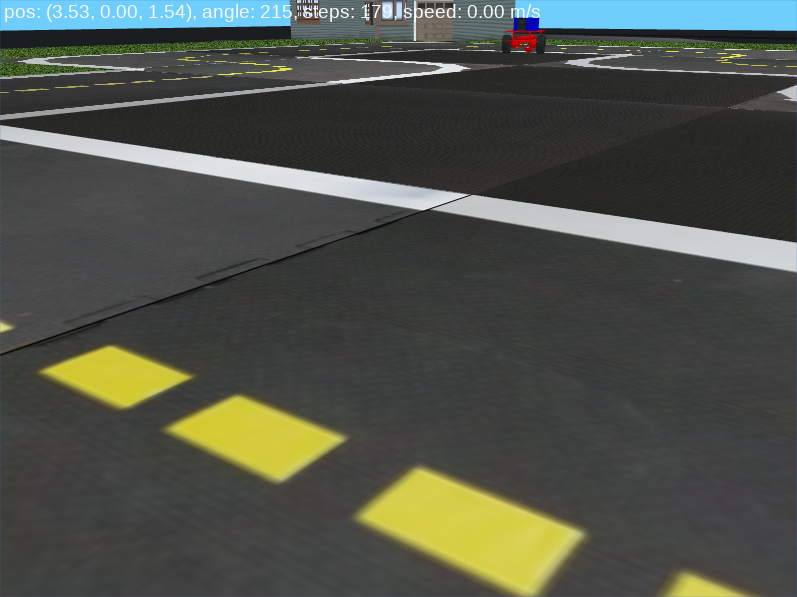

# **Map utilities**

This repository contains ***generator.py*** which generates maps and ***pathfinder.py*** ([Jump to](#path-finder)) which allows users to implement a path finding alorithm on a generated map.

# The Generator
***generator.py*** generates a random
map within the official [Duckietown Specifications](https://docs.duckietown.org/opmanual_duckietown/out/duckietown_specs.html) (section 2) to be used in [Gym-Duckietown](https://github.com/duckietown/gym-duckietown).

#### Generation phases
1. Generation of the road network using a backtracking algorithm
according to the parameters entered in *map_output* (terminal output shown):

<p align="center"></p>

* Note: in the terminal, each node is marked by its degree
* This file creates an
undirected cyclic graph, which when exported to *map_output.py* is translated to a 2D array of tiles selected from the following tile types:

><p align="center"></p>
>
>- empty
>- straight
>- curve_left
>- curve_right
>- 3way_left (3-way intersection)
>- 3way_right
>- 4way (4-way intersection)
>- asphalt
>- grass
>- floor (office floor)
>
>*(Taken from [Gym-Duckietown's README](https://github.com/duckietown/gym-duckietown/blob/master/README.md))*

2. Writing of the road network to yaml file *(output.yaml)* using the map format described in [Gym-Duckietown's README](https://github.com/duckietown/gym-duckietown/blob/master/README.md):

<p align="center"></p>

3. Population of the map with objects

* Objects selected from the following object types:

>- barrier
>- cone (traffic cone)
>- duckie
>- duckiebot (model of a Duckietown robot)
>- tree
>- house
>- truck (delivery-style truck)
>- bus
>- building (multi-floor building)
>- sign (many types)
>
>*(Taken from [Gym-Duckietown's README](https://github.com/duckietown/gym-duckietown/blob/master/README.md))*

4. Writing of the objects that were generated to output.yaml


## Installation:

In order to run this program you must have a working installation of Python 2.7+. The output is meant to be used with the [gym-duckietown simulator](https://github.com/duckietown/gym-duckietown), which has its own set of dependencies.

## Usage:

This program can be run by entering the following in a terminal while in the map-utils directory:
```
./generator.py --height <height> --width <width> --no-intersections --map-density <valid string> --no-border --side-objects <valid string> --road-objects <valid string> --hard-mode --sign-output --matrix-output
```
or
```
./generator.py --map-name <file.yaml> --no-intersections --map-density <valid string> --no-border --side-objects <valid string> --road-objects <valid string> --hard-mode --sign-output --matrix-output
```

#### Breakdown of the parameters

Required arguments:

* `--map-name` : a *.yaml* file specifying a map on which to place objects
    - must adhere to the Duckietown simulator map format (see [gym-duckietown](https://github.com/duckietown/gym-duckietown))

***OR***

* `--width` : an `int` describing the width of the map
    - width must be at least 3
    - this argument is required if a file is not specified with `--map-name`
* `--height` : an `int` describing the height of the map
    - height must be at least 3
    - this argument is required if a file is not specified with `--map-name`

Optional arguments:

* `--no-intersections` or `-ni` : if specified, the map generated will have no intersections (AKA a *closed course*). Otherwise, intersections will be allowed.
* `--map-density` or `-md` : specifies how densely packed the road network will be
    - valid input strings:
        - `"any"` (default)
        - `"sparse"`
        - `"medium"`
        - `"dense"`
    - if nothing is inputted, or the string is invalid, the map will be of density `"any"`
    - if the map is under a size of 7x7, any density entered will be ignored
* `--no-border` or `-nb` : if specified, the map generated will not have a border when output. Otherwise, it will be output with a border of empty tiles (grass, floor, or asphalt, chosen at random).
* `--side-objects` or `-so` : specifies the density of objects on **non-driveable tiles**
    - valid input strings:
        - `"empty"`
        - `"any"`
        - `"sparse"`
        - `"medium"` (default)
        - `"dense"`

* `--road-objects` or `-ro` : specifies the density of objects on **driveable tiles**
    - valid input strings:
        - `"empty"` (default)
        - `"any"`
        - `"sparse"`
        - `"medium"`
        - `"dense"`

* `--hard-mode` :
    - "Normal mode" (default): no objects on tiles adjacent to a *curve* already containing an object, or adjacent to an *intersection*
    - **Hard mode**: objects on any tile except for intersections
* `--sign-output` : outputs ***sign_output.yaml***, a feature-based map of signs to be used for navigation
    - `ID` represents april tag IDs according to the [signage specifications](http://docs.duckietown.org/opmanual_duckietown/out/signage.html)

<details>
<summary><b>ex. <i>sign_output.yaml</i></b></summary>

```yaml
signs:

- kind: sign_yield
  pos: [5.45, 1.0]
  rotate: 132.03
  ID: 2

- kind: sign_yield
  pos: [2.81, 2.0]
  rotate: 33.02
  ID: 2

- kind: sign_pedestrian
  pos: [5.4, 1.0]
  rotate: 45.49
  ID: 12

- kind: sign_pedestrian
  pos: [1.83, 3.0]
  rotate: 0.0
  ID: 12

- kind: sign_pedestrian
  pos: [1.83, 4.0]
  rotate: 180.0
  ID: 12
```

</details>
<br/>

* `--matrix-output` : outputs ***adj_matrix.npz***, a file containing:
    - **out**: a NumPy adjacency matrix of the generated road network
    - **dims**: a tuple of `(height, width)` for reconversion into a regular node graph or other representations

#### Examples

**Ex. 1**

```
./generator.py 7 5 --no-border --side-objects "medium" --road_objects "medium"
```
Outputs a map with dimensions 7x5 with no border medium object density including on roads:

**Terminal:**
<p align="center"></p>


<details>
<summary><b>output.yaml:</b></summary>

 ```yaml
 tiles:
- [asphalt,       asphalt,       asphalt,       asphalt,       curve_right/N, straight/W,    curve_left/N]
- [curve_right/N, straight/W,    straight/W,    3way_right/E,  curve_left/E,  grass,         straight/N]
- [straight/N,    asphalt,       asphalt,       straight/N,    asphalt,       grass,         straight/N]
- [curve_right/W, curve_left/N,  asphalt,       straight/N,    asphalt,       curve_right/N, curve_left/E]
- [asphalt,       curve_right/W, straight/W,    3way_right/W,  straight/W,    curve_left/E,  asphalt]

objects:

- kind: sign_right_T_intersect
  pos: [4.05, 2.05]
  rotate: 180
  height: 0.18

- kind: sign_stop
  pos: [2.95, 2.05]
  rotate: 0
  height: 0.18

- kind: sign_stop
  pos: [4.05, 0.95]
  rotate: 180
  height: 0.18

- kind: sign_T_intersect
  pos: [4.15, 0.95]
  rotate: 270
  height: 0.18

- kind: sign_left_T_intersect
  pos: [2.95, 0.95]
  rotate: 0
  height: 0.18

- kind: sign_stop
  pos: [2.85, 0.95]
  rotate: 270
  height: 0.18

- kind: sign_right_T_intersect
  pos: [2.95, 3.95]
  rotate: 0
  height: 0.18

- kind: sign_stop
  pos: [4.05, 3.95]
  rotate: 180
  height: 0.18

- kind: sign_stop
  pos: [2.95, 5.05]
  rotate: 0
  height: 0.18

- kind: sign_left_T_intersect
  pos: [4.05, 5.05]
  rotate: 180
  height: 0.18

- kind: sign_left_T_intersect
  pos: [4.05, 5.05]
  rotate: 180
  height: 0.18

- kind: sign_stop
  pos: [4.15, 5.05]
  rotate: 90
  height: 0.18

- kind: truck
  pos: [2.31, 0.71]
  rotate: 264.61
  height: 0.2

- kind: building
  pos: [0.85, 0.47]
  rotate: 180
  height: 0.6

- kind: bus
  pos: [3.75, 2.61]
  rotate: 90
  height: 0.18

- kind: sign_pedestrian
  pos: [1.89, 2.67]
  rotate: 182.3
  height: 0.18

- kind: sign_do_not_enter
  pos: [6, 3]
  rotate: 90.0
  height: 0.18

- kind: sign_do_not_enter
  pos: [7.0, 3.0]
  rotate: 270.0
  height: 0.18

- kind: sign_yield
  pos: [1.69, 1]
  rotate: 0
  height: 0.18

- kind: sign_yield
  pos: [1.69, 2]
  rotate: 180
  height: 0.18

- kind: bus
  pos: [2.44, 1.75]
  rotate: 0
  height: 0.18
 ```
</details>

<br/>

**Simulator:**
<p align="center"></p>

___

**Ex. 2**

```
./generatory.py --height 10 --width 10 --map-density "dense"
```
Outputs a *dense* map with dimensions 10x10 with no objects:

<p align="center"></p>

<details>
<summary><b>output.yaml</b></summary>

```yaml

tiles:
- [asphalt,       asphalt,       asphalt,       asphalt,       asphalt,       asphalt,       asphalt,       asphalt,       asphalt,       asphalt,       asphalt,       asphalt]
- [asphalt,       curve_right/N, straight/W,    3way_right/E,  straight/W,    straight/W,    straight/W,    straight/W,    curve_left/N,  grass,         grass,         asphalt]
- [asphalt,       straight/N,    asphalt,       straight/N,    asphalt,       asphalt,       asphalt,       asphalt,       curve_right/W, curve_left/N,  grass,         asphalt]
- [asphalt,       3way_right/N,  straight/W,    4way,          straight/W,    straight/W,    curve_left/N,  asphalt,       asphalt,       straight/N,    grass,         asphalt]
- [asphalt,       straight/N,    asphalt,       straight/N,    grass,         grass,         straight/N,    asphalt,       asphalt,       curve_right/W, curve_left/N,  asphalt]
- [asphalt,       straight/N,    asphalt,       curve_right/W, curve_left/N,  grass,         curve_right/W, curve_left/N,  asphalt,       asphalt,       straight/N,    asphalt]
- [asphalt,       curve_right/W, curve_left/N,  grass,         curve_right/W, curve_left/N,  grass,         straight/N,    asphalt,       asphalt,       straight/N,    asphalt]
- [asphalt,       grass,         straight/N,    grass,         grass,         curve_right/W, straight/W,    curve_left/E,  asphalt,       asphalt,       straight/N,    asphalt]
- [asphalt,       grass,         curve_right/W, straight/W,    curve_left/N,  grass,         grass,         grass,         curve_right/N, straight/W,    curve_left/E,  asphalt]
- [asphalt,       grass,         grass,         grass,         curve_right/W, curve_left/N,  grass,         curve_right/N, curve_left/E,  grass,         grass,         asphalt]
- [asphalt,       grass,         grass,         grass,         grass,         curve_right/W, straight/W,    curve_left/E,  asphalt,       grass,         grass,         asphalt]
- [asphalt,       asphalt,       asphalt,       asphalt,       asphalt,       asphalt,       asphalt,       asphalt,       asphalt,       asphalt,       asphalt,       asphalt]
```
</details>

<br/>

**Simulator:**
<p align="center"></p>

___

**Ex. 3**

```
./generator.py 5 5 --no-intersections --side-objects "sparse" --road-objects "sparse"
```
Outputs a 5x5 map with a border, and with no intersections and sparse object density, with none on the road:

<p align="center"></p>

<details>
<summary><b>output.yaml</b></summary>

```yaml

tiles:
- [grass,         grass,         grass,         grass,         grass,         grass,         grass]
- [grass,         grass,         grass,         curve_right/N, straight/W,    curve_left/N,  grass]
- [grass,         grass,         curve_right/N, curve_left/E,  asphalt,       straight/N,    grass]
- [grass,         curve_right/N, curve_left/E,  asphalt,       asphalt,       straight/N,    grass]
- [grass,         straight/N,    asphalt,       curve_right/N, straight/W,    curve_left/E,  grass]
- [grass,         curve_right/W, straight/W,    curve_left/E,  grass,         grass,         grass]
- [grass,         grass,         grass,         grass,         grass,         grass,         grass]


objects:

- kind: house
  pos: [0.69, 6.22]
  rotate: 0
  height: 0.5

- kind: house
  pos: [3.0, 0.32]
  rotate: 270
  height: 0.5

- kind: sign_yield
  pos: [6.68, 0.95]
  rotate: 17.63
  height: 0.18

- kind: duckiebot
  pos: [2.18, 4.4]
  rotate: 16.69
  height: 0.1

- kind: tree
  pos: [4.17, 0.26]
  rotate: 86.16
  height: 0.25

- kind: duckie
  pos: [6.22, 4.9]
  rotate: 166.33
  height: 0.08

- kind: tree
  pos: [6.77, 3.89]
  rotate: 121.33
  height: 0.25

- kind: sign_t_light_ahead
  pos: [6.77, 3.15]
  rotate: 142.28
  height: 0.18

- kind: tree
  pos: [6.48, 4.11]
  rotate: 329.35
  height: 0.25
```
</details>

<br/>

**Simulator:**
<p align="center"></p>

___

## Known bugs & problems

1. The *density* parameter does not scale well with size. It is currently calibrated to a 10x10 map. Due to the nature of smaller maps, where variation in density is very limited, any map under 7x7 in dimensions simply ignores any density entered, for the time being.

## Troubleshooting
This program is in beta, so if you run into any bugs, please [open an issue](https://github.com/duckietown/map-utils/issues)

# Have fun generating!


___

# Path-finder

***pathdfinder.py*** takes an adjacency matrix output by *generator.py* *(adj_matrix.npz)*, a startpoint, and an endpoint, and outputs a *path.yaml* containing the path calculated. This path is determined by the algorithm that the user decides to implement. No algorithm is implemented by default.

## How it works

1. *adj_matrix.npz* is loaded into the program
2. it is converted into an adjacency matrix where nodes are intersections, the startpoint, and the endpoint
3. a path finding algorithm **implemented by the user** is applied
    * by default a static placeholder path is present
4. The a visual representation of the path chosen is output to *path.yaml*


## Usage:

This program can be run by entering the following in a terminal while in the map-utils directory:
```
./pathfinder.py <file> <start_x> <start_y> <end_x> <end_y>
```

#### Breakdown of the parameters
All arguments are requred.

* `file` : the file path to *adj_matrix.npz* output by *generator.py*
* `start_x` : the x-coordinate of the startpoint for pathfinding. Together with `start_y` it must refer to a tile that is part of the road network.
* `start_y` : the y-coordinate of the startpoint for pathfinding. Together with `start_x` it must refer to a tile that is part of the road network.
* `end_x` : the x-coordinate of the endpoint for pathfinding. Together with `end_y` it must refer to a tile that is part of the road network.
* `end_y` : the y-coordinate of the endpoint for pathfinding. Together with `end_x` it must refer to a tile that is part of the road network.


#### Example

```
./pathfinder.py adj_matrix.npz 2 2 5 6
```

<details>
<summary><b>path.yaml:</b></summary>

```
0 0 0 1 1 1 1 0
0 0 0 1 0 0 1 0
0 0 S 1 0 0 1 0
0 0 0 0 0 0 1 0
0 0 0 0 0 0 1 0
0 0 0 0 0 0 1 0
0 0 0 0 0 X 1 0
0 0 0 0 0 0 0 0
```

* **S** is the startpoint
* **X** is the endpoint
* **1** is used for traversed tiles
</details>
