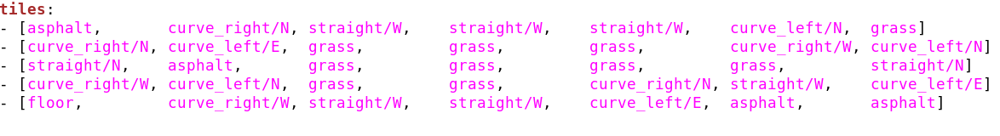
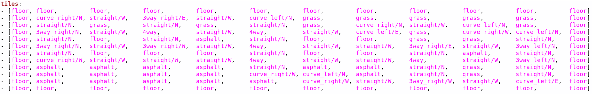

# **Random generation of Duckietown maps**

Semi-randomly generates [Duckietown](http://duckietown.org/) maps to be used in the [Gym-Duckietown](https://github.com/duckietown/gym-duckietown).

## Introduction
This repository uses three python files to generate a random
map within the official [Duckietown Specifications](https://docs.duckietown.org/opmanual_duckietown/out/duckietown_specs.html) (section 2).

#### Generation phases
1. Generation of the map by ***map_gen_beta_1.py*** : Generates a road system using a backtracking algorithm
according to the parameters entered in *map_output_beta_1* (terminal output shown):

<p align="center"></p>

* Note: in the terminal, each node is marked by its degree
* This file creates an
undirected cyclic graph, which when exported to *map_output_beta_1.py* is translated to a 2D array of tiles selected from the following tile types:

><p align="center"></p>
>
>- empty
>- straight
>- curve_left
>- curve_right
>- 3way_left (3-way intersection)
>- 3way_right
>- 4way (4-way intersection)
>- asphalt
>- grass
>- floor (office floor)
>
>*(Taken from [Gym-Duckietown's README](https://github.com/duckietown/gym-duckietown/blob/master/README.md))*

2. ***map_output_beta_1.py*** writes road network to yaml file *(output.yaml)* using the map format described in [Gym-Duckietown's README](https://github.com/duckietown/gym-duckietown/blob/master/README.md):

<p align="center"></p>

3. ***populate_beta_1.py (NOT YET WRITTEN)*** populates the map with objects

* Objects selected from the following object types:

>- barrier
>- cone (traffic cone)
>- duckie
>- duckiebot (model of a Duckietown robot)
>- tree
>- house
>- truck (delivery-style truck)
>- bus
>- building (multi-floor building)
>- sign_blank (a blank sign post)
>
>*(Taken from [Gym-Duckietown's README](https://github.com/duckietown/gym-duckietown/blob/master/README.md))*

4. ***map_output_beta_1.py*** writes the objects that were generated to output.yaml


## Installation:

In order to run this program you must have a working installation of Python 3.5+.

## Usage:

This program can be run by entering the following in a terminal while in the map-utils directory:
```
./map_output_beta_1 <width> <height> --no_intersections --density <valid string> --no_border
```

#### Breakdown of the parameters

Positional (required) arguments:
* `width` : an `int` describing the width of the map
    - width must be at least 3
* `height` : an `int` describing the height of the map
    - height must be at least 3

Optional arguments:
* `--no_intersections` or `-ni` : if specified, the map generated will have no intersections (AKA a *closed course*). Otherwise, intersections will be allowed.
* `--density` : specifies how densely packed the road network will be
    - valid input strings:
        - `"any"`
        - `"sparse"`
        - `"medium"`
        - `"dense"`
    - if nothing is inputted, or the string is invalid, the map will be of density `"any"`
    - if the map is under a size of 7x7, any density entered will be ignored
* `--no_border` or `-nb` : if specified, the map generated will not have a border when output. Otherwise, it will be output with a border of empty tiles (grass, floor, or asphalt, chosen at random).

#### Examples

```
./map_output_beta_1 7 5 --no_intersections --no_border
```
Outputs a map with dimensions 7x5 with no intersections and no border:

<p align="center"></p>

<p align="center"></p>

___
```
./map_output_beta_1 7 5 --density "dense"
```
Outputs a *dense* map with dimensions 10x10:

<p align="center"></p>

<p align="center"></p>

## Known bugs & problems

1. Occasionally, the map generation will loop for an inordinately long time. To deal with this, a 2-second timer is placed around the backtracking section of the code. If the generation exceeds it, the growth is stopped and the function *trim()* is called. In these cases, maps are usually very close to being finished and valid, so this function will *trim* any stretches of road leading nowhere, as the goal is to have a completely cyclical road with no dead ends.
2. The *density* parameter does not scale well with size. It is currently calibrated to a 10x10 map. Due to the nature of smaller maps, where variation in density is very limited, any map under 7x7 in dimensions simply ignores any density entered, for the time being.

## Troubleshooting
This program is in beta, so if you run into any bugs, please [open an issue](https://github.com/duckietown/map-utils/issues)

# Have fun generating!
